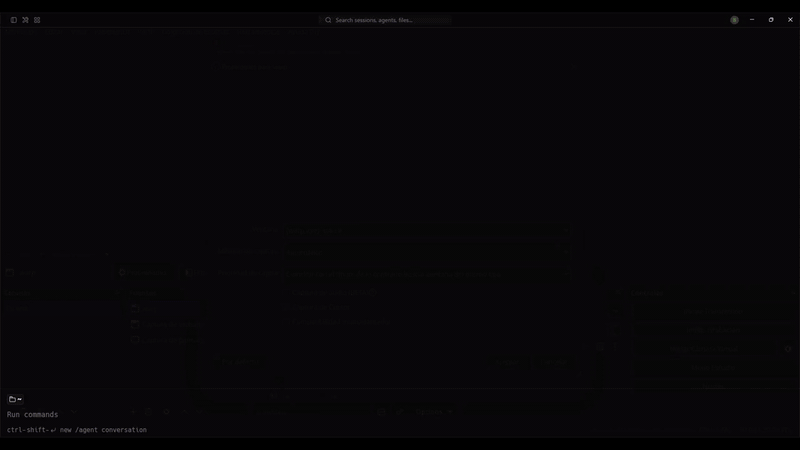

<h1 align="center">Starcil</h1>
<p align="center"><em>La terminal para trabajar con agentes de IA.</em></p>
<p align="center">
  <a href="https://starcil.xtarify.app/">Web</a> ·
  <a href="https://github.com/daybigo/starcil/releases/latest">Descargar</a> ·
  <a href="https://github.com/daybigo/starcil/actions/workflows/ci.yml"></a>
  <a href="https://github.com/daybigo/starcil/releases/latest"></a>
  <a href="LICENSE"></a>
</p>

<p align="center">
  <a href="https://starcil.xtarify.app/video-starcil.mp4"></a><br>
  <sub>▶ <a href="https://starcil.xtarify.app/video-starcil.mp4">Ver el video completo</a></sub>
</p>

Starcil es un multiplexor de terminal pensado para agentes de código. Organiza tus terminales
en **workspaces, pestañas y paneles**, reconoce los agentes que corren dentro (Claude Code,
Codex, Gemini, OpenCode, Copilot y más), te muestra cuál está trabajando, cuál está libre y
cuál se quedó esperando una respuesta, y expone toda la sesión por un comando `starcil` y una
API por socket. Así un agente en un panel puede abrir otros, darles instrucciones y esperar
sus resultados.

## Instalación

Windows 10/11, x86_64. Un solo comando descarga la última versión, verifica su checksum
SHA-256, pone `starcil` en tu `PATH` y no toca tu configuración. Vuelve a correrlo para
actualizar.

```powershell
irm https://starcil.xtarify.app/install.ps1 | iex
```

¿Prefieres un archivo? Baja `starcil-x86_64-pc-windows-gnu.zip` de la
[última release](https://github.com/daybigo/starcil/releases/latest), descomprime
`starcil.exe` en cualquier carpeta de tu `PATH`. El `SHA256SUMS` de al lado cubre todos los
archivos.

Linux y macOS todavía no: el servidor y el cliente se hablan por named pipes de Windows, y el
transporte por Unix socket es lo siguiente en la lista.

## Primeros pasos

```powershell
starcil                  # abre la sesión por defecto (arranca su servidor si hace falta)
starcil --session work   # un servidor y árbol de workspaces independiente
```

- Un panel de shell tiene **un solo lugar para escribir**: el composer `❯` de abajo. Tab
  completa rutas contra la carpeta real del panel y comandos del `PATH`; `↑`/`↓` recorren un
  historial que arranca con el de tu propio shell; `Ctrl+R` lo busca; `Ctrl+V` pega en el
  borrador. El prompt de arriba solo muestra lo que corrió. Mientras un programa (vim, un
  script que pregunta algo) corre en el panel, las teclas van a ese programa hasta que vuelve
  el prompt.
- El **dock** del composer lanza los agentes que tengas en el `PATH` (`Alt+1`…`9`). Cuando
  Starcil reconoce un agente en el panel, el composer se esconde: el agente trae el suyo.
- El **prefijo** es `Ctrl+B`: luego `v` divide a la derecha, `-` divide abajo, `h/j/k/l`
  mueven el foco, `z` hace zoom, `c` abre una pestaña, `b` esconde la barra lateral, `q`
  se desconecta, `?` lista todo. Las pestañas se arrastran para reordenar; los paneles se
  redimensionan con el mouse.
- Las sesiones **persisten**: cierra la terminal y el servidor conserva los paneles; el
  siguiente `starcil` los restaura, cada uno en la carpeta donde estaba.

## Para agentes

Un agente que corre dentro de un panel de Starcil maneja la sesión con el mismo CLI que tú:

```powershell
starcil pane split --current --direction right --no-focus
starcil agent start reviewer --kind codex --pane w1:p2
starcil agent prompt reviewer "revisa el diff de este repo y escribe tus hallazgos en REVIEW.txt" --wait
starcil pane read w1:p2 --source recent --lines 40
starcil agent wait reviewer --until idle --timeout 600000
```

`starcil --skill` imprime el skill que un agente necesita para trabajar así: la mecánica,
cómo llevar una flota pequeña (roles, briefs, esperar archivos en vez de pantallas) y las
trampas de la plataforma. Instálalo una vez para Claude Code con el CLI `skills`, o pega la
salida en las instrucciones de cualquier agente:

```powershell
npx skills add daybigo/starcil --skill starcil -g
```

Claude Code y Codex pueden reportar su estado con precisión por hooks en vez de detección
por pantalla: `starcil integration install claude` / `codex`. Los demás grupos de comandos
(`workspace`, `tab`, `pane`, `agent`, `worktree`, `terminal`, `session`, `api`, `config`,
`notification`, `plugin`…) salen con `starcil --help`; `starcil api` habla el protocolo del
socket directamente en NDJSON.

## Configuración

`%APPDATA%\starcil\config.toml` (`starcil --default-config` imprime todas las claves con su
valor por defecto; `starcil config check` valida el archivo). Algunas claves útiles:

| Clave | Qué hace |
| --- | --- |
| `terminal.default_shell` | `""` elige `pwsh.exe`, si no `powershell.exe`; pon `cmd.exe` explícito si lo quieres |
| `ui.dock.agents` | qué CLIs ofrece el dock, en orden |
| `theme.name`, `[theme.custom]` | 12 temas incluidos más overrides por token |
| `keys.*` | todo el mapa de teclas; `starcil config reset-keys` respalda y limpia tus cambios |
| `update.channel` | `stable` (por defecto) o `preview` |

Starcil revisa GitHub al arrancar por si hay una versión nueva y pregunta antes de
instalarla; `starcil update` lo hace cuando tú quieras.

## Compilar desde el código

Rust estable con el target `x86_64-pc-windows-gnu` (ver `rust-toolchain.toml`) y un toolchain
GNU en el `PATH` (los runners de Windows de GitHub ya lo traen; en local, w64devkit funciona):

```powershell
cargo build --release -p starcil
cargo test --workspace
```

El binario queda en `target/release/starcil.exe`. `packaging/verify-install.ps1` instala un
build local a través del instalador real en un perfil aislado y limpia todo al terminar.

## Hecho por Xtarify

<p align="center">
  <a href="https://xtarify.com"></a>
</p>

Starcil nace dentro de [Xtarify](https://xtarify.com), la herramienta que crea la página web
de tu negocio hablando con IA: sin plantillas ni diseñadores, describes lo que haces y en
menos de un minuto tienes tu web lista para publicar. Starcil es la base sobre la que van a
trabajar los agentes que construyen esas webs, y por eso lo abrimos: para que cualquiera pueda
usarlo con sus propios agentes.

## Licencia

Apache License 2.0 — ver [LICENSE](LICENSE) y [NOTICE](NOTICE).
